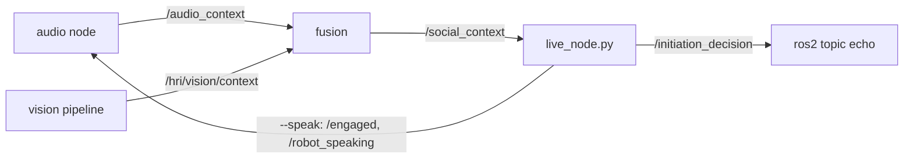

# conversation_initiator

Decides whether the BWIbot should speak to a nearby person. It takes one JSON
snapshot of the scene (the person, the soundscape, and the robot's own
history), asks an LLM to score it against a small set of numbered rules, and
gets back an action: `remain_silent`, `wait`, `greet`, or `respond`. When the
answer is to speak, a second, smaller call writes the line.

Right now this is a laptop MVP, with no ROS and no robot. The scene JSON is
typed by hand into vignette files, so the decision logic can be tested before
the audio and vision nodes are wired together.

## How it works

```
 scene JSON  ──►  validate  ──►  gate.py  ──►  call 1 (mvp.py)  ──►  call 2
 (one tick)      schema v2.0     "is it       scores rubric,        only on greet
                                  worth        applies rules,        or respond:
                                  asking?"     picks action          the line to say
```

1. **A scene arrives.** On the robot this will be about 3 times a second. In
   the MVP it is one vignette file. It is checked against
   [`schema/social_context.schema.json`](schema/social_context.schema.json)
   first, so a misspelled field fails loudly instead of reading as "not seen".
2. **The gate decides whether to call the LLM at all.** Most ticks look like
   the last one, so asking again would only cost money and latency. The gate
   runs locally and needs no API key.
3. **The LLM scores the scene.** It rates six dimensions from 1 to 5, then
   picks the action and category those scores support:

   | Dimension | 1 | 5 |
   |---|---|---|
   | `invitation` | ignoring the robot | clearly seeking contact |
   | `interruption_cost` | idle | deep in work or conversation |
   | `urgency` | nothing needs saying | appears lost or distressed |
   | `redundancy` | never engaged | the robot just spoke to them |
   | `ambient_fit` | speech would be inaudible or intrusive | well suited |
   | `addressivity` | unclear who to address | one clear person |

4. **Rules break ties, in priority order.** A higher rule always wins:

   | Rule | Says |
   |---|---|
   | R1 | Never greet someone in a conversation with another person |
   | R2 | Never greet if the robot spoke in the last 30 s, or was ignored twice |
   | R3 | Don't greet someone walking past without facing the robot |
   | R4 | Don't greet someone absorbed in work unless they look at the robot |
   | R5 | Greet when they face the robot, are stationary, and within about 3 m |
   | R6 | When evidence is thin or contradictory, stay silent |

5. **The answer comes back as structured output,** matching
   [`schema/decision.schema.json`](schema/decision.schema.json). `rule_fired`
   names the rule that drove the choice, which is what makes a wrong answer
   debuggable.
6. **Only if the action is `greet` or `respond`,** a second call writes the
   line and picks its volume, rate, and pitch. Keeping it separate means the
   silent cases, which are most of them, never pay for generating text.
   The call is skipped when the post-filter blocks the action. With
   `--provider jev`, a greet uses a fixed line with the volume set by
   `noise_level`, so there is no second call. Jev cannot write text, so a
   `respond` line comes from the first of Groq, Gemini, and Anthropic that
   has a key. If that call fails, the next one is tried.
   `JEV_REPLY_PROVIDER` picks which one goes first.

Scores come before the action in the schema on purpose. The model commits to
its reading of the scene first, and then picks the action.

## The scene JSON

The contract is [`SCHEMA.md`](SCHEMA.md), version 2.0. A typical vignette
context:

```json
{
  "schema_version": "2.0",
  "t": 1727020800.0,
  "ambient": {
    "noise_floor_db": -58.4,
    "noise_level": "quiet",
    "speech_snr_db": null,
    "speech_now": false,
    "speech_ratio_10s": 0.0,
    "seconds_since_speech": null
  },
  "target": {
    "distance_m": 2.1,
    "facing_robot": true,
    "gaze_at_robot_s": 1.4,
    "motion": "stationary",
    "in_conversation": false,
    "activity": "idle"
  },
  "bystanders": [],
  "robot": {
    "is_speaking": false,
    "engaged": false,
    "last_spoke_s_ago": null,
    "consecutive_no_response": 0
  }
}
```

- **`ambient`** is what the audio node in
  [`../audio_signals_FRI_II`](../audio_signals_FRI_II) measures, under its
  own field names. Levels are dBFS, so more negative means quieter. `null`
  means not measured: a `null` pause means nobody has spoken yet, and while
  `robot.is_speaking` is true every field is `null` because the microphone
  only hears the robot. The prompt in `mvp.py` explains each field to the
  model.
- **`target`** and **`bystanders`** will come from the vision node. `target`
  is `null` when nobody is there.
- **`robot`** is the robot's own state and history.

`mvp/context.py` has `audio_to_context()`, which turns one audio node object
into this shape, and `validate()`, which checks any context against the schema.

## The parts

```
conversation_initiator/
├── README.md               this file
├── SCHEMA.md               the /social_context contract, v2.0
├── SCHEMA_COMPARISON.md    why the schema looks the way it does
├── MVP_PLAN.md             the four-day plan, results so far, go/no-go
├── IMPLEMENTATION_PLAN.md  the full ROS 2 build, after the MVP passes
├── schema/                 the JSON Schemas and a round-trip example
├── playground/             local chat UI: change the scene, talk to the robot
│   ├── server.py           FastAPI wrapper around mvp.py and postfilter.py
│   └── web/                React app (Vite)
└── mvp/
    ├── mvp.py              runs every vignette through the LLM, prints a table
    ├── context.py          schema validation and the audio node adapter
    ├── fusion_adapter.py   fusion wrapper message to a v2.0 context, no ROS
    ├── test_fusion_adapter.py  adapter tests, no ROS or key needed
    ├── live_node.py        ROS node on flexo: /social_context in, decisions out
    ├── gate.py             local pre-filter, no network
    ├── test_gate.py        gate and contract tests + a 100-tick simulation
    ├── postfilter.py       hard rules the model answer cannot override
    ├── test_postfilter.py  post-filter tests
    ├── prosody.py          speech enums to Azure SSML
    ├── tts.py              Deepgram or Azure text to speech, with a disk cache
    ├── test_tts.py         prosody and TTS tests, no key needed
    ├── stt.py              Deepgram speech to text for the playground mic
    ├── test_stt.py         STT tests, no key needed
    ├── requirements.txt
    ├── .env.example        copy to .env and add your key
    └── vignettes/          test scenes, 001–025. 009–021 need labels
```

### `mvp.py`: the decision

Holds the system prompt (rubric, field guide, rules), the decision models,
and a backend for each provider. Anthropic Claude Haiku 4.5 and Google Gemini
3.1 Flash-Lite share the same prompt and schema, so their results can be
compared directly.

`--rubric 6` (the default) uses the full decision schema and the second speech
call. `--rubric 3` is the original three-score decision with no speech, kept so
the two can be benchmarked against each other.

Each call has a 5 s timeout (`--timeout`) and no SDK retries, so a slow call is
reported as slow instead of being hidden inside a retry. A timeout counts as a
miss, as it would on the robot. Before timing anything it makes one throwaway
call per schema, because the first call is slow while the provider compiles it.

For each vignette it prints the expected action, the model's action, the
scores, and each call's latency. The summary reports:

| Line | Meaning |
|---|---|
| agreement | matches over all calls, and over the calls that answered |
| false greets | spoke when it should not have; the costly error, target 0 |
| greet recall | of the cases that should greet, how many did |
| timeouts, errors | calls that never returned a decision |
| flipped across repeats | vignettes whose action changed with `--repeat` |

Vignettes with no `expect` label are skipped, so you can add a case without
seeing the model's answer first.

### `gate.py`: whether to ask at all

A pure function, `should_ask_llm(ctx, state)`, that returns `(ask, reason)`.
It skips the LLM when:

| Reason | When |
|---|---|
| `no_person` | `target` is `null` |
| `self_speaking` | the robot is talking |
| `gave_up` | ignored twice in a row |
| `cooldown` | asked less than 3 s ago |
| `no_material_change` | nothing meaningful moved since the last ask |

Material changes are: distance, facing, motion, conversation, or a new
transcript on the target;
`noise_level`, a 6 dB move in `noise_floor_db`, or `speech_now` flipping in
the room; and the robot starting or stopping speaking, crossing the 30 s
greeting cooldown, or being ignored again. After 10 s it asks again
regardless. At 3 Hz an ungated loop would make about 10,000 calls an hour; the
gate suppresses 91% of them in the test simulation.

### `postfilter.py`: rules the model cannot override

`enforce(ctx, action)` runs after the model answers. It returns
`(action, blocked_by)`. It can only change `greet` or `respond` to
`remain_silent` or `wait`. It never makes the robot speak.

| Rule | Blocks |
|---|---|
| `no_person` | any speech when `target` is `null` |
| `self_speaking` | any speech while the robot is talking |
| `R2 ignored twice` | any speech when `consecutive_no_response` is 2 or more |
| `R1 target in conversation` | `greet` when `target.in_conversation` is true |
| `R2 spoke recently` | `greet` when the robot spoke less than 30 s ago |
| `respond without transcript` | `respond` when there is no `partial_transcript` |
| `person mid-sentence` | `respond` when `syntactically_complete` is false. The action becomes `wait`, so the robot replies once the person finishes. |

R3 and R4 need judgment, so the filter leaves them to the model. `mvp.py`
still scores the model's own action. It prints each block and the number of
false greets left after the filter.

### `tts.py`: text to speech

`tts.py` turns each line into audio and saves it in `tts_cache/`. A line
already in the cache plays from disk with no network call.

Deepgram Aura-2 is the default engine. It supports `rate` through its speed
setting. It has no volume control, so `tts.py` scales the samples itself.
That way one Deepgram clip serves every volume. Deepgram has no pitch
control, so `pitch` is ignored.

Set `TTS_PROVIDER=azure` to use Azure instead. Azure supports all three
settings through SSML, which `prosody.py` builds. The model never writes SSML.

The greeting is a fixed line, so `python3 tts.py --warm` caches it at all
three volumes with one Deepgram call. After that, a greet needs no TTS call.
Only `respond` lines call the engine live.

Add `DEEPGRAM_API_KEY` to `.env`. `DEEPGRAM_VOICE` is optional. The default
is `aura-2-thalia-en`.

### `vignettes/`: the test set

Each file is one scene plus the answer a person would give, written before
running the model:

```json
{
  "id": "001",
  "expect": "greet",
  "note": "why this case exists",
  "context": { "schema_version": "2.0", "ambient": {}, "target": {}, "robot": {} }
}
```

Several come in pairs that differ in a single field, so a wrong answer points
at one cause. `005` has the same geometry as `001` but the robot has already
been ignored. `008` has someone facing the robot while talking to someone
else, which tests that R1 beats R5. `009` is `001` while the robot is
speaking, with every audio field `null`.

## Running it

```bash
cd conversation_initiator/mvp
python3 -m venv .venv && source .venv/bin/activate
pip install -r requirements.txt
cp .env.example .env                 # add ANTHROPIC_API_KEY or GEMINI_API_KEY

python3 test_gate.py                 # gate and schema tests, no key needed
python3 test_fusion_adapter.py       # fusion mapping tests, no ROS or key needed
python3 test_postfilter.py           # post-filter tests, no key needed
python3 test_tts.py                  # prosody and TTS tests, no key needed
python3 test_stt.py                  # STT tests, no key needed
python3 tts.py --warm                # cache the 3 greetings (needs Deepgram key)
python3 tts.py "Hello there"         # say one line
python3 mvp.py --provider jev --tts --play   # decide, then speak each line
python3 mvp.py                       # Anthropic, the default
python3 mvp.py --provider gemini
python3 mvp.py --repeat 3            # three passes: steadier latency, and flips
python3 mvp.py --rubric 3            # the original three-score decision
```

A disagreement row is marked `<-- disagrees`. Read all of them before
changing the prompt. With nine cases, patching after each one fits the prompt
to noise. `MVP_PLAN.md` covers how to classify them and what counts as a pass.

## Playground

A local chat UI for probing the model one field at a time. You type as the
person in front of the robot. Switches on the left set the scene. Each robot
reply shows the action, the line, the rule fired, the rubric, any post-filter
block, the latency, and the fields you changed since the last turn.

```bash
cd conversation_initiator/mvp && source .venv/bin/activate
pip install -r ../playground/requirements.txt
cd ../playground && uvicorn server:app --host 127.0.0.1 --port 8000   # terminal 1
cd web && npm install && npm run dev                                  # terminal 2
```

Open <http://localhost:5173>. The server reads keys from `mvp/.env`. The keys
never reach the browser.

- **Send** puts your text in `target.speech.partial_transcript`. It also sets
  `robot.engaged`, because the audio node only transcribes while engaged.
- **Check scene** sends the scene with no speech. Use it to test greetings.
- After each turn the app writes `last_utterance`, `last_spoke_s_ago` and
  `recent_decisions`, as the initiator node would.
- **+5 s** and **+30 s** move time forward. Use them to test the 30 s
  greeting cooldown. **Ignored** adds one to `consecutive_no_response`.
- **Save as vignette** writes the current scene to `mvp/vignettes/` with
  `expect: null`. Label it before you use it.
- With nobody present, the server returns `no_person` and makes no model call.

[`playground/README.md`](playground/README.md) explains each part and has a
test checklist. The playground does not measure accuracy. Use `mvp.py` on
labelled vignettes for that. Groq's free tier allows about 4 turns a minute. The server retries
once after a rate limit, so a fast click can wait about 15 s.

## Live on flexo

`mvp/live_node.py` connects the MVP to the robot. It reads the fusion node's
`/social_context`, builds a v2.0 context, runs the gate, the LLM and the
post-filter, and publishes each decision on `/initiation_decision`.



### Setup, once, on flexo

```bash
cd ~/fri2_f26/conversation_initiator/mvp
python3 -m venv --system-site-packages .venv
.venv/bin/pip install -r requirements.txt
cp .env.example .env    # add GROQ_API_KEY; add DEEPGRAM_API_KEY for --speak
```

`--system-site-packages` lets the venv see `rclpy` from ROS 2 Humble. Do
not commit `.env`.

### Run

```bash
python3 ~/fri2_f26/fusion/fusion_publisher.py            # terminal 1
cd ~/fri2_f26/conversation_initiator/mvp                 # terminal 2
.venv/bin/python live_node.py                            # dry run
ros2 topic echo /initiation_decision --field data        # terminal 3, optional
```

The node sources `/opt/ros/humble/setup.bash` itself if ROS is not loaded.
It prints one line for each LLM call and a gate summary every 30 s. Each
call is also appended to `mvp/live_logs/<date>.jsonl` as `{context, result}`.
A context from that log can be copied into a vignette.

| Flag | Effect |
|---|---|
| (none) | Dry run. Decide and publish. Nothing is said, and `/engaged` is not published. |
| `--engaged` | Dry run that also publishes `/engaged` true, so the audio node transcribes. Use it to test `respond`. |
| `--speak` | Full loop. Says each line with `tts.py`. Publishes `/robot_speaking` during playback and `/engaged` after the robot speaks. |
| `--provider`, `--model` | Default `groq` and its default model. |
| `--rate` | Ticks per second. Default 3. |
| `--stale-sec` | Ask again after this long, even with no change. Default 30, because 10 uses up Groq's free tier. |
| `--timeout` | Seconds per LLM call. Default 8. On a timeout the robot stays silent. |

In a dry run, the node acts as if the robot said each line. So
`last_spoke_s_ago`, the 30 s cooldown and the conversation history behave as
they would with `--speak`. Because nobody hears the line, the no-reply count
goes up after 8 s.

### How the fusion message maps to the schema

`fusion_adapter.py` does the mapping. The fusion message holds the raw
`/audio_context` and `/hri/vision/context` messages.

| Schema | From |
|---|---|
| `ambient.*` | The audio fields with the same names (`context.AMBIENT_FIELDS`). Empty if audio is more than 3 s old. |
| `target` | The nearest person with a distance. The current target stays unless someone is 0.5 m nearer. `null` if vision is more than 2 s old. |
| `target.facing_robot` | `orientation == "facing_robot"` |
| `target.gaze_at_robot_s` | Seconds of continuous `gaze == "toward_robot"`. Left out if orientation is stale. |
| `target.motion` | `direction`: `approaching`, `receding` to `leaving`, `stationary`. Left out if `unknown`. |
| `target.dwell_s` | `dwell_time_s` |
| `target.speech` | A new audio `transcript`, held until one LLM call uses it. A transcript more than 3 s old when first seen is skipped. |
| `bystanders` | Everyone else with a distance. |
| `robot`, `recent_decisions`, `conversation` | Kept by the node. A new target, or no target for 10 s, ends the interaction. |

Vision does not measure `in_conversation`, `activity` or `bearing_deg`, so
the adapter leaves them out. Rules R1 and R4 then depend on the model alone.

## Adding a vignette

1. Pick the next number and a filename that describes the scene.
2. Write `expect` before you run anything. Leave it `null` until you have;
   the runner skips unlabelled files.
3. Build `ambient` from what the microphone would actually report. Use a
   quiet floor below −50 dBFS, moderate below −40, and loud above that. Leave
   fields `null` where the audio node would.
4. Use only the schema's values for `motion` and `activity`. Free text that
   describes the answer, like `talking_with_bystander`, makes the test easy.
5. Say in `note` what the case is meant to catch.
6. Run `python3 test_gate.py`; it validates every vignette against the schema.

## What's next

`live_node.py` is a first version of the ROS node in `IMPLEMENTATION_PLAN.md`.
It is a plain script, not a colcon package. It has not run on flexo yet.
Langfuse tracing and a daily call cap are not done.
