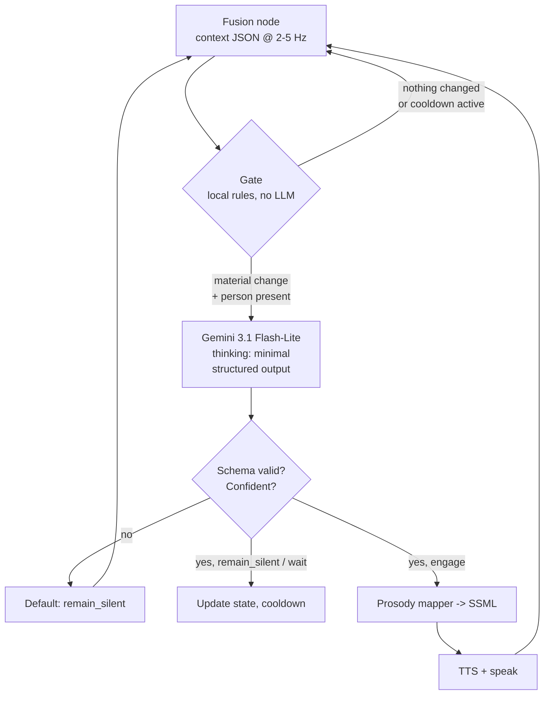

# LLM Decision Layer — Design Proposal

**Project:** Context-aware conversation initiation for the BWIbot
**Component owner:** Jenna Lee
**Scope:** Everything downstream of the structured context JSON — the decision to speak, and the shaping of what is said.
**Last updated:** September 17, 2026

---

## 1. The finding that changes the architecture

**A reasoning LLM cannot sit in the real-time loop.** Two hard numbers:

- Artificial Analysis measures **Gemini 3.7 Flash at ~9.8 s time-to-first-token** (high thinking, 10k input tokens); Gemini 3.6 Flash is ~17.7 s. Even allowing that our prompts are far smaller, this is a model family that thinks by default, and thinking cannot be fully disabled on Gemini 3.x.
- Skantze & Irfan (arXiv:2501.08946), the paper recommended for this project, achieve a **1.5 s median response time** and treat 0.5 s as the practical floor. Human turn gaps are ~0.2 s. Their entire LLM + TTS budget is ~1.5 s.

Therefore the LLM does **not** decide *when* to speak at millisecond precision. It decides **whether speaking would be socially appropriate, and what to say**. Precise speech onset stays in a fast local layer. This separation is the backbone of the design and follows directly from the recommended paper.

Second constraint: the Gemini free tier for Flash-Lite is approximately **15 requests/minute and ~1000 requests/day** — one call every four seconds. Calling the LLM once per audio window exhausts the quota within the first minute of a demo.

---

## 2. Proposed architecture: gated cascade



### 2.1 The gate

**The gate is the most important component, and it contains no AI.** It is roughly fifty lines of local logic answering:

- Is a person present at all?
- Has the situation materially changed since the last decision?
- Are we inside a cooldown window?
- Did we already engage this person and get ignored?

It reduces LLM calls by one to two orders of magnitude and keeps the system inside the free tier. Everything downstream becomes straightforward once this exists.

### 2.2 One call, not two

The original proposal describes stage 1 (action selection) followed by stage 2 (speech shaping). These should **not** be two API calls — that doubles both latency and rate-limit consumption. Use a single call with a nested schema in which the speech fields are nullable, and the model populates them only when it has chosen to engage.

---

## 3. Model selection

| Model | Structured output | Default thinking | Verdict |
|---|---|---|---|
| `gemini-3.1-flash-lite` | Yes | `minimal` | **Primary choice.** Google documents this model explicitly for classifier and router workloads |
| `gemini-3.5-flash` | Yes | `medium` | Fallback for hard cases; force `thinking_level: "low"` |
| `gemini-3.7-flash` | Yes | high, dynamic | Too slow for the loop; acceptable for offline analysis |
| `gemini-3.8-live` | **No** | interleaved | Audio-to-audio, ultra-low latency, but no structured output — cannot serve as the decision layer |

### 3.1 Corrections for the paper

- The current draft specifies **"Gemini 3.8 Flash," which does not exist.** The latest Flash model is 3.7; there is a separate Gemini 3.8 *Live*.
- **State the thinking level explicitly in the methods section.** It affects latency results more than the model name does.

### 3.2 Future work note

`gemini-3.8-live` deserves one sentence as future work: once the robot has *decided* to engage, delegating the spoken conversation to the Live API (native barge-in, server-side VAD, affective dialog) is the natural sequel. Out of scope for this iteration.

---

## 4. Input: the context JSON

Keep this small — tokens translate directly into latency. Target under ~600 tokens including the rules block.

**Key design decision:** do **not** send a room label. Send observable acoustic and social properties and let the model infer the setting. This directly addresses the guidance to avoid pre-defining environments for the robot.

```json
{
  "t": 1789456123.4,
  "since_last_decision_s": 6.2,
  "ambient": {
    "noise_db": 41.5,
    "noise_trend": "steady",
    "other_speech_active": false,
    "speech_sources_estimated": 0,
    "reverberance": "low"
  },
  "target": {
    "distance_m": 1.4,
    "bearing_deg": -8,
    "facing_robot": true,
    "gaze_on_robot": true,
    "motion": "approaching",
    "dwell_s": 4.1,
    "speech": {
      "detected": true,
      "partial_transcript": "sorry do you know where",
      "syntactically_complete": false,
      "prosody": {"pitch_semitones_rel": 1.2, "energy_rel": 0.6, "rate_wpm": 168},
      "tone_estimate": "uncertain",
      "tone_confidence": 0.61
    }
  },
  "bystanders": [
    {"distance_m": 3.2, "facing_robot": false, "in_conversation": true}
  ],
  "robot": {
    "is_speaking": false,
    "last_utterance": null,
    "last_spoke_s_ago": null,
    "consecutive_no_response": 0
  },
  "recent_decisions": [
    {"s_ago": 11.0, "action": "wait", "reason": "person_in_conversation"}
  ]
}
```

### 4.1 Three fields worth highlighting

- **`syntactically_complete`** is a cheap stand-in for TurnGPT. Even a part-of-speech heuristic captures most of the value.
- **`bystanders` with `in_conversation`** makes multiparty a first-class input rather than reducing it to "closest person wins."
- **`recent_decisions`** prevents the robot from repeating the same question. This is the single most common failure mode in systems of this kind.

---

## 5. Encoding the rules

The rules must be **explicit, numbered, and auditable** in the system instruction — not buried in descriptive prose. The model then *scores* against a rubric before acting, which yields interpretability and a debugging surface.

The rubric approach is adapted from the Inner Thoughts framework (arXiv:2501.00383), which scores candidate contributions 1–5 on Relevance, Information Gap, Expected Impact, Urgency, Coherence, Originality, Balance, and Dynamics.

### 5.1 Initiation rubric

| Dimension | Question | Score 1 | Score 5 |
|---|---|---|---|
| `invitation` | Is the person signaling they want contact? | walking away, no gaze | facing, gaze held, addressing robot |
| `interruption_cost` | What breaks if I speak? | mid-conversation, focused work | idle, waiting |
| `urgency` | Does something need saying now? | nothing | person appears lost or distressed |
| `redundancy` | Have I said this already? | just asked | never engaged |
| `ambient_fit` | Would speech fit this soundscape at all? | near-silent, others working | active social noise |
| `addressivity` | Am I sure who to address? | ambiguous group | one clear person |

### 5.2 Example politeness rules

Write eight to twelve numbered rules referencing the rubric dimensions. For example:

1. If another person is speaking and the target is participating, do not initiate; return `wait`.
2. Never initiate toward a person whose `motion` is `leaving` unless `urgency` >= 4.
3. If `consecutive_no_response` >= 2, return `remain_silent`.
4. If `ambient_fit` <= 2, either remain silent or reduce volume to `x-soft`.
5. If `addressivity` <= 2, return `insufficient_evidence` rather than guessing a target.

Set `temperature: 0` for reproducibility.

---

## 6. Output schema

Structured output requires **both** `response_mime_type: "application/json"` and a `response_schema` to guarantee valid JSON. Nullable types keep the speech block absent when the robot stays silent.

```json
{
  "type": "object",
  "properties": {
    "rubric": {
      "type": "object",
      "properties": {
        "invitation":        {"type": "integer"},
        "interruption_cost": {"type": "integer"},
        "urgency":           {"type": "integer"},
        "redundancy":        {"type": "integer"},
        "ambient_fit":       {"type": "integer"},
        "addressivity":      {"type": "integer"}
      },
      "required": ["invitation","interruption_cost","urgency",
                   "redundancy","ambient_fit","addressivity"]
    },
    "action":   {"type": "string", "enum": ["remain_silent","wait","greet","respond"]},
    "category": {"type": "string", "enum": ["appropriate_to_initiate",
                                            "inappropriate_to_interrupt",
                                            "person_needs_assistance",
                                            "insufficient_evidence"]},
    "rule_fired": {"type": "string"},
    "confidence": {"type": "number"},
    "recheck_in_ms": {"type": "integer"},
    "speech": {
      "type": ["object","null"],
      "properties": {
        "text":   {"type": "string"},
        "volume": {"type": "string", "enum": ["x-soft","soft","medium","loud"]},
        "rate":   {"type": "string", "enum": ["slow","medium","fast"]},
        "pitch":  {"type": "string", "enum": ["low","medium","high"]},
        "target_person_id": {"type": ["integer","null"]}
      },
      "required": ["text","volume","rate","pitch"]
    }
  },
  "required": ["rubric","action","category","rule_fired","confidence","recheck_in_ms"]
}
```

### 6.1 Design notes

- **`rule_fired`** names which encoded rule drove the decision, making every choice traceable in the results section.
- **`recheck_in_ms`** lets the model set its own cooldown, which is preferable to a fixed timer.
- Gemini generates keys in **schema order**, so placing `rubric` first forces the model to score before deciding — effectively free chain-of-thought without a separate reasoning pass.

---

## 7. Speech shaping to SSML

The LLM emits **abstract enums**; a deterministic Python mapper converts them to SSML. The model should never write raw SSML — it is brittle and hard to validate.

```python
SSML = '<speak><prosody volume="{v}" rate="{r}" pitch="{p}">{t}</prosody></speak>'
```

### 7.1 Engine caveats

- **AWS Polly neural and generative voices ignore the `pitch` attribute** (standard voices support it).
- **Azure Speech supports full SSML**, including pitch.

Since Azure for Students provides $100/year at no cost, **Azure is the recommended TTS**. If staying within AWS is preferred, `tts-ros2` provides an existing ROS 2 Polly node.

---

## 8. Failure handling

This section separates a demo that survives a live FAIR presentation from one that does not.

- **Timeout at ~800 ms, then return `remain_silent`.** Silence is always the safe default. Never block the robot on a network call.
- **Validate the schema and apply a rule-based post-filter** on every response. Reject anything violating a hard rule regardless of what the model returned.
- **Enforce hysteresis** via `recheck_in_ms` so the robot cannot oscillate between `greet` and `remain_silent`.
- **Cache the system instruction.** Flash-Lite supports context caching, and the rules block is identical on every call.
- **Log every `(context_json, response_json, latency_ms)` tuple.** This is not only debugging infrastructure — it is the dataset and the entire results section. Begin logging on day one.

---

## 9. Evaluating the LLM layer

Perform this **offline on frozen JSON vignettes**, not on the live robot. It is roughly two orders of magnitude cheaper and is the only route to real statistics.

1. Build 60–100 context JSON snapshots covering the target scenarios. Harvest real ones from logs, then hand-perturb.
2. Have **three or more humans label each** snapshot with the correct action.
3. **Report human–human agreement first** (Fleiss' kappa, or Krippendorff's alpha if annotator counts vary). This establishes the ceiling. Omitting it is the most common methodological error: if humans agree at only kappa = 0.5, an LLM at 70% accuracy is performing well, and that cannot be known without the measurement.
4. Evaluate the LLM against the adjudicated reference: accuracy, per-class precision/recall/F1, and a confusion matrix.
5. Use **Spearman's rho** for the ordinal rubric scores. The comparable HRI study (arXiv:2403.05701) found GPT-4 at rho ~ 0.82–0.83 against human social intuitions, a reasonable target to cite.
6. Implement the two baselines as **prompt ablations on the identical vignette set**: context-unaware (rules only, no JSON) and single-context (audio-only, vision-only). Same model, same schema, ablated input.
7. Report **P50 and P95 latency measured with the actual schema and thinking level**, not vendor benchmark numbers.

---

## 10. Build order

Mapped onto the existing project timeline, with LLM work front-loaded to avoid blocking on sensor availability.

| Date | Deliverable |
|---|---|
| Sep 22 | Freeze the context schema. Write 20 vignettes **by hand** — do not wait for sensors |
| Oct 1 | Rules, rubric, and output schema. Working `generate_content` call with structured output |
| Oct 8 | Latency harness: P50/P95 across models and thinking levels. Select and justify one |
| Oct 15 | The gate, cooldowns, timeout fallback, full logging |
| Oct 22 | Replace hand-written JSON with the real fusion node. End-to-end integration |
| Oct 29 | Prosody-to-SSML mapper and TTS wired up |
| Nov 5 | Human labeling round on 60–100 vignettes; compute kappa |
| Nov 12 | Baseline ablations, confusion matrices, Spearman correlations |

**Critical structural point:** stub the fusion node's output independently. Hand-write the JSON files. The entire LLM layer then becomes testable and can be completed before teammates' sensor nodes exist, turning integration day into a configuration change rather than a crisis.

---

## 11. Free resources that apply

- **Gemini API free tier** — Flash-Lite at ~15 RPM / ~1000 RPD, no credit card required. Sufficient *provided the gate works*. Note that the free tier may use prompts for product improvement, which matters for an IRB-adjacent study; Tier 1 removes this and costs nothing upfront.
- **Azure for Students, $100/year** via the GitHub Student Developer Pack — Azure Speech for full-SSML neural TTS.
- **GitHub Student Developer Pack** — also provides Copilot and JetBrains licenses.

---

## 12. Open questions

1. **Library list.** The list of freely available libraries was not received. If it includes an emotion-recognition package, a turn-taking model, or a TTS with an existing student license, several recommendations above would change.
2. **Turn-taking ownership.** Is the millisecond-level turn-taking layer in scope for this component or assigned elsewhere? If in scope, a lightweight VAP-style model is the highest-value addition and the most direct through-line to the recommended paper.

---

## 13. References

- Skantze, G. and Irfan, B. "Applying General Turn-taking Models to Conversational Human-Robot Interaction." arXiv:2501.08946.
- Liu et al. "Proactive Conversational Agents with Inner Thoughts." arXiv:2501.00383.
- "DiscussLLM: Teaching Large Language Models When to Speak." arXiv:2508.18167.
- "Are Large Language Models Aligned with People's Social Intuitions for Human-Robot Interactions?" arXiv:2403.05701.
- Su, Z. and Sheng, W. "Context-aware proactive and adaptive conversation for human-robot interaction." *Robotics and Autonomous Systems*, vol. 195, 2026.
- Gemini API structured output documentation: https://ai.google.dev/gemini-api/docs/structured-output
- Gemini thinking levels documentation: https://ai.google.dev/gemini-api/docs/generate-content/thinking
